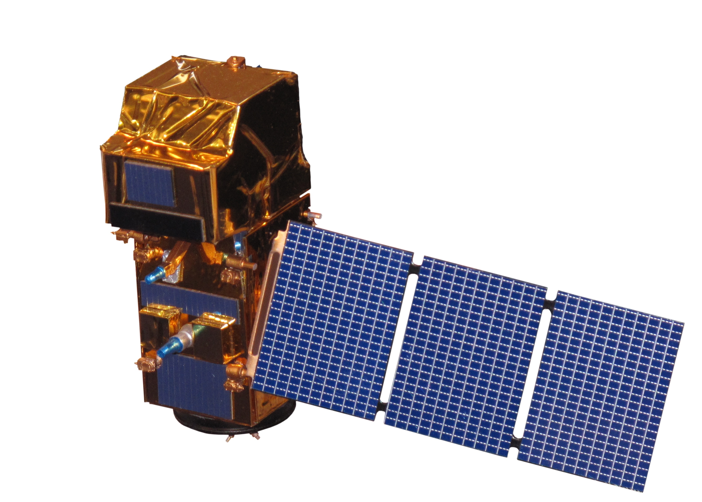

```{r setup, include=FALSE}
options(htmltools.dir.version = FALSE)
```

```{r bibliography, include=FALSE}

# Code supplied by Andy (see wk2 slides 25-28)

library(RefManageR)
BibOptions(check.entries = FALSE,
           bib.style = "authoryear",
           cite.style = "authoryear",
           style = "markdown",
           hyperlink = TRUE,
           dashed = FALSE,
           no.print.fields=c("doi", "url", "urldate", "issn"))
# myBib <- ReadBib("./Bib.bib", check = FALSE)

```

```{r xaringan-themer, include=FALSE, warning=FALSE}
library(xaringanthemer)
style_mono_accent(
  base_color = "#1c5253",
  header_font_google = google_font("Merriweather Sans"),
  text_font_google   = google_font("Merriweather", "300", "300i"),
  code_font_google   = google_font("Fira Mono")
)
```

```{r image, echo=FALSE, out.width='80%', fig.align='center'}

```

???

All text under the three question marks are presentation notes; it is hidden from the presentation slides and only available in presenter mode.

---
class: inverse, center, middle

# Get Started
---

# Summary

The Sentinel-2 is ...

```{r eval=FALSE, tidy=FALSE}
# example of visible code
remotes::install_github("yihui/xaringan")
```

--

Sub-slide within section 1 (summary)

-   Leads to bullet points

--

-   Secondary sub-slide within section 1, continues bullet points

--

-   Third sub-slide, includes footnote

.footnote\[ \[1\] See [Link](https://github.com/yihui/xaringan/issues/2) for further information\]

------------------------------------------------------------------------

# remark.js

You can see an introduction of remark.js from [its homepage](https://remarkjs.com). You should read the [remark.js Wiki](https://github.com/gnab/remark/wiki) at least once to know how to

-   create a new slide (Markdown syntax<sup>\*</sup> and slide properties);

-   format a slide (e.g. text alignment);

-   configure the slideshow;

-   and use the presentation (keyboard shortcuts).

It is important to be familiar with remark.js before you can understand the options in **xaringan**.

.footnote\[\[\*\] It is different with Pandoc's Markdown! It is limited but should be enough for presentation purposes. Come on... You do not need a slide for the Table of Contents! Well, the Markdown support in remark.js [may be improved](https://github.com/gnab/remark/issues/142) in the future.\]

---
class: inverse, middle, center

# Using xaringan
---

# remark.js vs xaringan

Some differences between using remark.js (left) and using **xaringan** (right):

.pull-left\[ 1. Start with a boilerplate HTML file;

1.  Plain Markdown;

2.  Write JavaScript to autoplay slides;

3.  Manually configure MathJax;

4.  Highlight code with `*`;

5.  Edit Markdown source and refresh browser to see updated slides; \]

.pull-right\[ 1. Start with an R Markdown document;

1.  R Markdown (can embed R/other code chunks);

2.  Provide an option `autoplay`;

3.  MathJax just works;<sup>\*</sup>

4.  Highlight code with `{{}}`;

5.  The RStudio addin "Infinite Moon Reader" automatically refreshes slides on changes; \]

.footnote\[\[\*\] Not really. See next page.\]

------------------------------------------------------------------------

# Math Expressions

You can write LaTeX math expressions inside a pair of dollar signs, e.g. \$\alpha+\beta\$ renders $\alpha+\beta$. You can use the display style with double dollar signs:

    $$\bar{X}=\frac{1}{n}\sum_{i=1}^nX_i$$

$$\bar{X}=\frac{1}{n}\sum_{i=1}^nX_i$$

Limitations:

1.  The source code of a LaTeX math expression must be in one line, unless it is inside a pair of double dollar signs, in which case the starting `$$` must appear in the very beginning of a line, followed immediately by a non-space character, and the ending `$$` must be at the end of a line, led by a non-space character;

2.  There should not be spaces after the opening `$` or before the closing `$`.

3.  Math does not work on the title slide (see [#61](https://github.com/yihui/xaringan/issues/61) for a workaround).

------------------------------------------------------------------------

# R Code

```{r comment='#'}
# a boring regression
fit = lm(dist ~ 1 + speed, data = cars)
coef(summary(fit))
dojutsu = c('地爆天星', '天照', '加具土命', '神威', '須佐能乎', '無限月読')
grep('天', dojutsu, value = TRUE)
```

------------------------------------------------------------------------

# R Plots

```{r cars, fig.height=4, dev='svg'}
par(mar = c(4, 4, 1, .1))
plot(cars, pch = 19, col = 'darkgray', las = 1)
abline(fit, lwd = 2)
```

------------------------------------------------------------------------

# Tables

If you want to generate a table, make sure it is in the HTML format (instead of Markdown or other formats), e.g.,

```{r}
knitr::kable(head(iris), format = 'html')
```

------------------------------------------------------------------------

# HTML Widgets

I have not thoroughly tested HTML widgets against **xaringan**. Some may work well, and some may not. It is a little tricky.

Similarly, the Shiny mode (`runtime: shiny`) does not work. I might get these issues fixed in the future, but these are not of high priority to me. I never turn my presentation into a Shiny app. When I need to demonstrate more complicated examples, I just launch them separately. It is convenient to share slides with other people when they are plain HTML/JS applications.

See the next page for two HTML widgets.

------------------------------------------------------------------------

```{r out.width='100%', fig.height=6, eval=require('leaflet')}
library(leaflet)
leaflet() %>% addTiles() %>% setView(-93.65, 42.0285, zoom = 17)
```

------------------------------------------------------------------------

```{r eval=require('DT'), tidy=FALSE}
DT::datatable(
  head(iris, 10),
  fillContainer = FALSE, options = list(pageLength = 8)
)
```

------------------------------------------------------------------------

class: center, middle

# Thanks!

Slides created via the R package [**xaringan**](https://github.com/yihui/xaringan).

The chakra comes from [remark.js](https://remarkjs.com), [**knitr**](https://yihui.org/knitr/), and [R Markdown](https://rmarkdown.rstudio.com).
