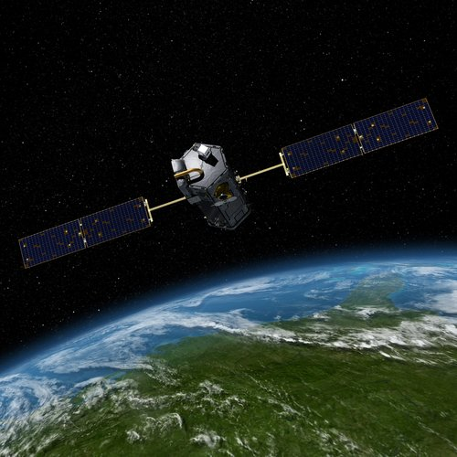
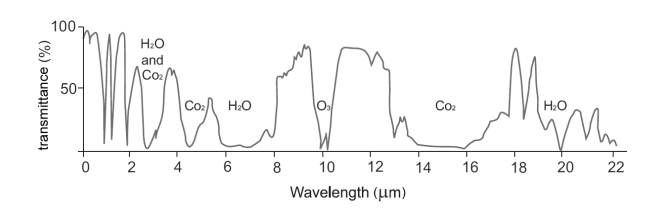

```{r setup, include=FALSE}
options(htmltools.dir.version = FALSE)
library(dplyr)
library(readr)
library(knitr)
```

```{r setupbibliography, include=FALSE}

# Code supplied by Andy (see wk2 slides 25-28)

library(RefManageR)
library(knitcitations)
BibOptions(check.entries = FALSE,
           bib.style = "authoryear",
           cite.style = "authoryear",
           style = "markdown",
           hyperlink = TRUE,
           dashed = FALSE,
           no.print.fields=c("doi", "url", "urldate", "issn"))
myBib <- ReadBib("references.bib",
                 # "./Bib.bib", 
                 check = FALSE)

```

```{r xaringan-themer, include=FALSE, warning=FALSE}
library(xaringanthemer)
style_mono_accent(
  base_color = "#fa4b3e",
  header_font_google = google_font("Poppins"),
  text_font_google   = google_font("inter", "300", "300i"),
  code_font_google   = google_font("Fira Mono")
)
```

```{r image, echo=FALSE, out.width='80%', fig.align='center'}

```

???

All text under the three question marks are presentation notes; it is hidden from the presentation slides and only available in presenter mode.


---

# Summary

OCO-2 stands for **O**rbiting **C**arbon **O**bservatory 2. It was developed by NASA with the objective of providing precise and time-dependent measurements of atmospheric carbon dioxide (CO<sub>2</sub>), across the globe. It is the first satellite designed specifically for studying atmospheric CO<sub>2</sub> from space, and therefore also acts to validate the effectiveness of space-based measurement methods `r Citep(myBib, "nasaOrbitingCarbonObservatory22023")`. 

--

The satellite holds three spectrometers: One spectrometer for observation of atmospheric oxygen, in the Near Infrared band, and two spectrometers for observation of CO<sub>2</sub>, in the Short-wavelength Infrared band.The sensors have been designed to observe very specific ranges of the electromagnetic spectrum where Oxygen and CO<sub>2</sub> absorb light `r Citep(myBib, "europeanspaceagencyOCO2OrbitingCarbon2012")`. 

--

```{r image-emspectrum, echo=FALSE, out.width='80%', fig.align='center'}

```

.small[Transmittance of atmospheric gases, from `r Citep(myBib, "tempfliPrinciplesRemoteSensing2009", after = ", p.71")`]
---

class: inverse, middle, center

```{r infotbl, echo=FALSE, message=FALSE}

infotbl <- readr::read_csv("casa0023_wk2_xaringan_files/oco2-stats.csv")
knitr::kable(infotbl, format = 'html', col.names = c("Dimension", "Value"),
             caption = "Table 1: Summary of OCO-2 Satellite Features")
```


---

# Applications

Why is the OCO-2 important?

-   The standard for atmospheric measurement of CO<sub>2</sub> is through ground-based stations around the world. 
-   However, this leads to large areas of the globe where there is a lack of precise measurement available.
-   Space-based remote sensing through OCO-2 provides global observations at high frequency, precision and spatial resolution `r Citep(myBib, "europeanspaceagencyOCO2OrbitingCarbon2012")`. 

--

How has it been used?

-   Emissions data from the OCO-2 are open access, for the entire span of the mission (September 2014 onwards), from NASA's [GES DISC](https://disc.gsfc.nasa.gov/datasets?keywords=OCO-2%20v10r&page=1) repository. The data has been pre-processed and corrected. 

-   In 2022 `r Citet(myBib, "weirRegionalImpactsCOVID192021", .opts = list(max.names=3, longnamesfirst=FALSE))` published research that identified  _short-term_, _regional_ changes in atmospheric CO<sub>2</sub>, attributable to human activities. The research combined the high frequency OCO-2 CO<sub>2</sub> data with data and analysis from another NASA tool - the Goddard Earth Observing System (GEOS). 

---

# Applications

How has it been used in urban/cities research?

-   `r Citet(myBib, "anMonitoringAtmosphericCarbon2022", .opts = list(max.names=3, longnamesfirst=FALSE))` have tested the applicability of OCO-2 data to analyse patterns of city-scale CO<sub>2</sub> emissions in Pakistan.
-   `r Citet(myBib, "ciocaEffectsPandemicRestrictions2022")` used OCO-2 data to monitor changes in levels of air pollution in European urban areas following COVID-19 lockdowns.
-   `r Citet(myBib, "nassarAdvancesQuantifyingPower2021", .opts = list(max.names=3, longnamesfirst=FALSE))` have compared reported CO<sub>2</sub> emissions from fossil fuel power plants to measurements taken from OCO-2, to estimate reporting error and monitoring gaps. 

---

class: inverse, middle, center

# So what does it all mean?
---

# Reflections

Investigating the OCO-2 has been an opportunity to learn more in-depth about the features of satellites and remote sensing principles. 

Points of interest: 
-   The variety in purpose and capability of different remote sensors. The OCO-2 is one of a suite of NASA satellites released as part of a Climate Continuity Mission, which are designed for the observation of atmospheric gases, clouds, and pollutants - as opposed to the terrestrial surface. 

--

-   The importance of a satellite's orbit; for example, how a **sun-synchronised orbit (SSO)** means that a satellite always passes over a point on the globe at the same time of day, which allows for meaningful comparisons of change over time.

--

-   Discovery of useful resources - specifically, the European Space Agency's [**eoPortal**](eoportal.org), which provides an encyclopaedia of resources related to satellites, sensors, and earth observation missions. 

---

# Reflections


How could the data be used in future work? 

-   As discussed in the **Applications** section, OCO-2 has been used at the city-scale level to track regional emissions patterns, monitoring of power plants, and to assess air pollution for public health. For my own work, I would be interested in researching further how the data can be applied in a climate and health context. It would also be good to explore further the remote sensing data available in the GES DISC repository. 

---

# References

```{r bibliography, results='asis', echo=FALSE, warning=FALSE}
PrintBibliography(myBib
                  # , start = 1, end = 7
                  )
```
